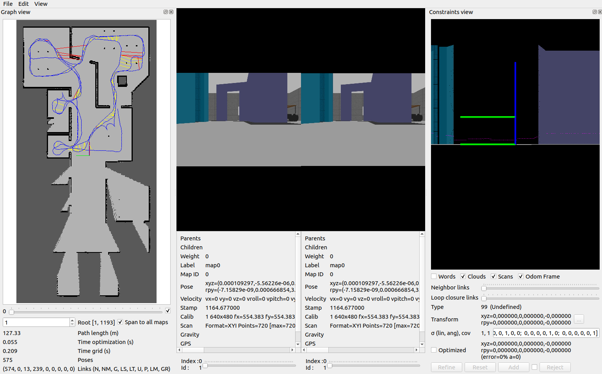
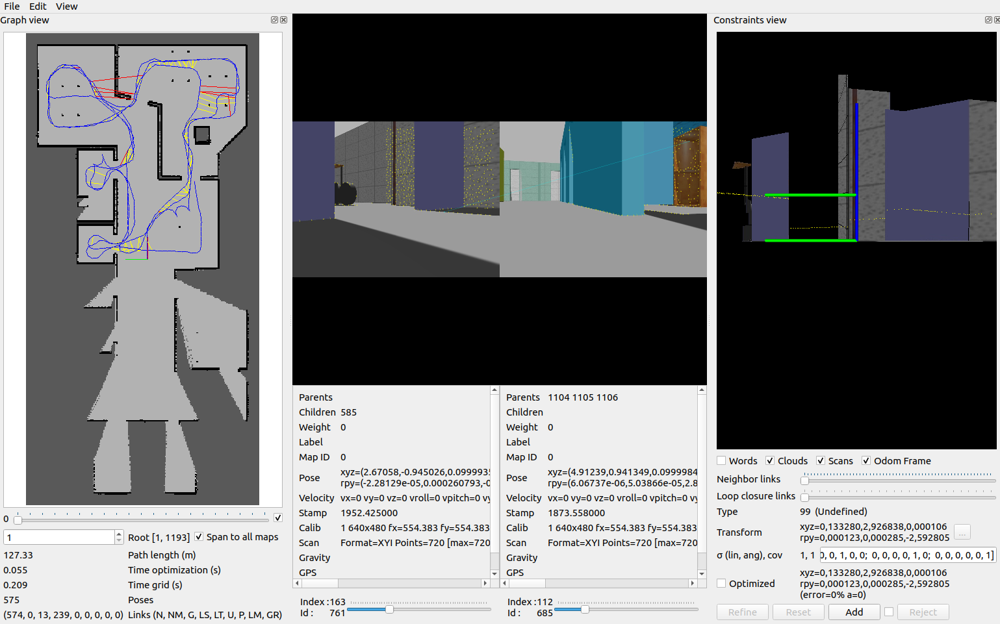
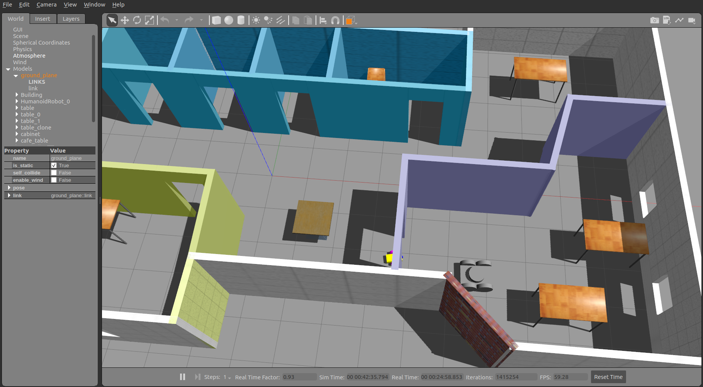
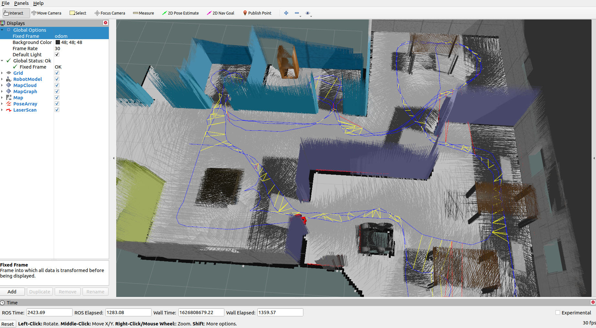
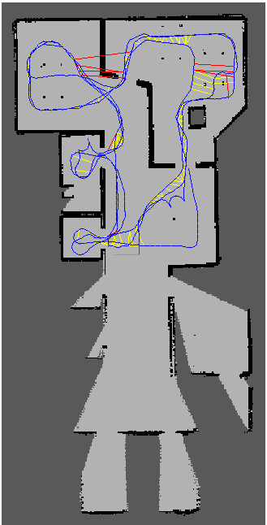
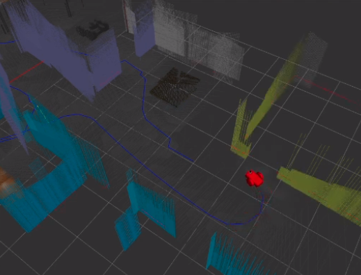

# Robotics Simulation - Map My World - SLAM
In this robotics simulation a custom *mobile robot* moves in a building and performs [*SLAM - Simultaneous-Localization-And-Mapping*](https://en.wikipedia.org/wiki/Simultaneous_localization_and_mapping) to construct a map of it's environment, while simultaneously localizing itself relative to this map. In other words SLAM is a method to perform simultaneously [Localization](https://en.wikipedia.org/wiki/Robot_navigation) and [Mapping](https://en.wikipedia.org/wiki/Robotic_mapping). An example, of how Localization works is shown in the project [Where Am I](https://github.com/michailtam/where-am-i), where a particle filter is used to locate the robot in the building. The accuracy of the map depends on the accuracy of the localization and vice versa. The algorithm provides the possibility to the robot to navigate and act in an unknown environment. The term unknown means that there is no map provided which the robot can use. Think of an autonomous vacuum cleaner, which is cleaning an unknown room or building. SLAM gets used in nearly every robotics application including ground, aerial and vessel robots, self-driving cars etc. There are many different algorithms which perform SLAM. One of them is FastSLAM which gets described in this [paper](http://robots.stanford.edu/papers/montemerlo.fastslam-tr.pdf). In order, for the robot to be capable to map its environment, it has to be equiped with special sensors. One way to do this is to use a [Lidar sensor](https://en.wikipedia.org/wiki/Lidar) which reflects the rays from the walls to calculate the distance to the obstacles. The second way is to use an [RGB-D camera](https://en.wikipedia.org/wiki/Kinect) which includes a single visual camera combined with a laser rangefinder or infrared depth sensor. This allows to determine the depth in an image (i.e. distance to a wall). If you are interested to learn more about range imaging, please refer to the following [website](https://en.wikipedia.org/wiki/Range_imaging). Unfortunately, reading sensor data tends to be noisy, because of a fault or a bad calibrated sensor. A better way is to perform sensor fusion, which means that multiple sensor data from different sensors get combined together to achieve a better result. 

## Development System
The simulation was developed and tested on the operating system Ubuntu 20.04 LTS using the simulator [gazebo](http://gazebosim.org/) and the ROS version [Noetic](https://www.ros.org/). To perform SLAM the [RTAB-Map package](http://wiki.ros.org/rtabmap_ros) was used which implements a RGB-D SLAM approach with real-time constraints. To observe the behavior visually the visualization tool [Rviz](http://wiki.ros.org/rviz) was used which displayed the created map.

## Features
- To capture the sensor data a laser scanner gets used which subscribes to the **/scan** topic
- The Robot can be navigated manually by the teleop package
- The supported laser scanners in ROS are [these](http://wiki.ros.org/Sensors#A2D_range_finders)
- The RTAB-DB viewer allows the analysis of the complete mapping session (loop closures etc.)

## Installation
To install the project with it's necessary packages, please follow the steps bellow. If you encounter any problems please refer to the [discussion forum of ROS](https://discourse.ros.org/) to get further help.

1. Clone the repository ```$ git clone https://github.com/michailtam/map-my-world.git```
2. You need also to install the **ROS Navigation Stack** by issuing in the src folder```$ git clone -b noetic-devel https://github.com/ros-planning/navigation.git```
3. Build the project by issuing ```$ catkin_make``` in the toplevel folder of the workspace

## Running the simulation:
To run the simulation follow the following steps:

Open a terminal, change into the toplevel of the catkin_workspace and issue: 
```$ ./test_mapping.sh```

After, the simulation has started you can navigate the robot using the teleop package shortcuts and observe in parallel in rviz how the map gets created.

## RTAB-DB Viewer:
The [**rtabmap-databaseViewer**](https://github.com/introlab/rtabmap/wiki/Tools) is a tool to explore the created database, when the mapping process has completed. It is isolated from ROS which allows the complete analysis the mapping session. This makes it possible to check for loop closures, generate 3D maps, extract images, and much more!. To run the RTAB-DB Viewer issue 
```$ rtabmap-databaseViewer ~/.ros/rtabmap.db```.
Once the viewer is opened, you need to execute the following steps to add some windows to view relevant information:

Choose Yes for using the database parameters
View -> Constraint View
View -> Graph View

## Screenshots
| **1st RTAB-DB Output** |
| :--- |
| Left: The created 2D map and the path the robot is traversing, Center: The output of the camera, Right: The constraints view | 
| **Screenshot** |
|  |

| **2nd RTAB-DB Output** |
| :--- |
| Left: The created 2D map and the path the robot is traversing, Center: The output of the camera, Right: The constraints view |
| **Screenshot** |
|  |

| **3D Office visualization in Gazebo** |
| :--- |
| The office where the robot is moving and performs SLAM |
| **Screenshot** |
|  |

| **SLAM visualization in Rviz (in 3D)** |
| :--- |
| The visualized output in rviz after performing SLAM |
| **Screenshot** |
|  |

| **Created 2D Map after SLAM** | **Created 3D Map after SLAM** |
| :---: | :---: | 
| The created 2D office map | The created 3D office map |
| **Screenshots** | **Screenshots** |
|  |  |

An example of executing SLAM is shown in the video below.

## Video
<a href="https://youtu.be/6FNHveEkFfM" target="_blank">
