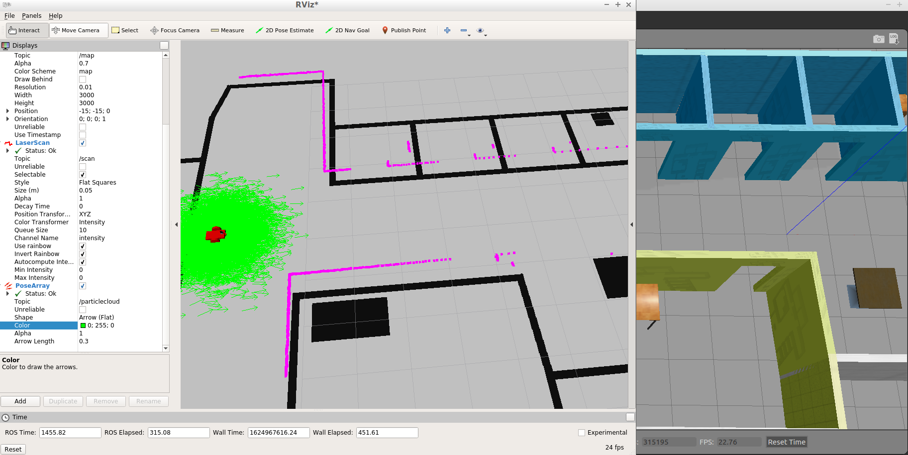
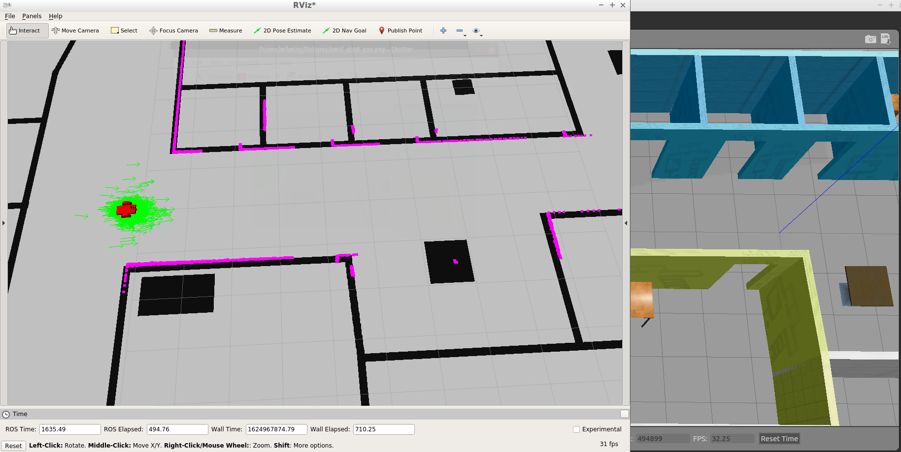
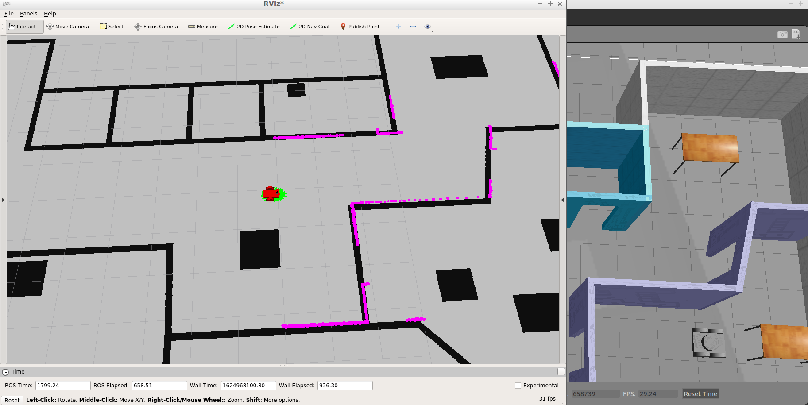
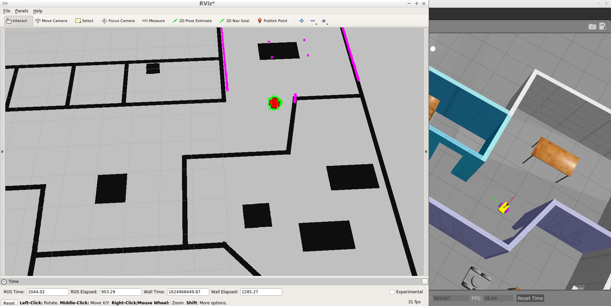
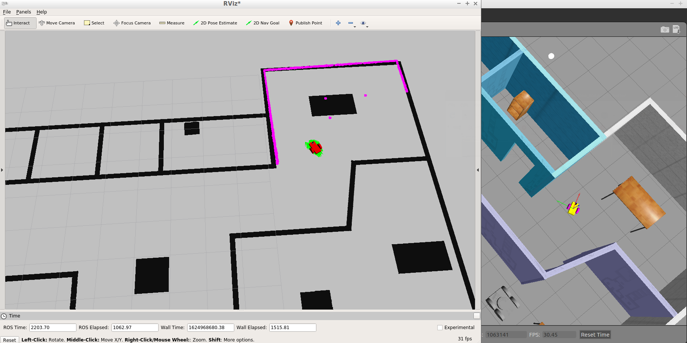

# Robotics Simulation - Where Am I 

In this robotics simulation in [gazebo](http://gazebosim.org/) a custom *mobile robot* applies the Adaptive Monte Carlo Localization algorithm (AMCL), to determine it's position and pose in the environment (i.e. world). The (AMCL ROS package)[http://wiki.ros.org/amcl] improves the localization process of the MCL algorithm, due to dynamically adjusting the number of particles over a period of time, as the robot navigates in the map. In addition, the robot applies laser scanning ([Lidar](https://en.wikipedia.org/wiki/Lidar) to get data for mapping the environment. The ROS version that gets used in the project is [ROS-Kinetic](https://www.ros.org/). The 3D visualization tool [Rviz tool for ROS](http://wiki.ros.org/rviz) gets used to ... (to be continued) 

### Features
- An adaptive version (AMCL) of the Monte Carlo Localization [MCL](https://en.wikipedia.org/wiki/Monte_Carlo_localization) algorithm gets applied, which dynamically adjusts the number of particles over a period of time, as the robot navigates in the a environment. This provides a significant computational advantage over the MCL algorithm. In other words, AMCL gets used to take odometry and laser scan data to perform the AMCL localization.
- A laser scaner gets applied to map the environment (i.e. building), which helps the robot to determine its surroundings.
- The ROS (Map Server node)[http://wiki.ros.org/map_server)] provides map data as a ROS service to other nodes and locates the map which gets created by the [ROS Map Creator](https://github.com/udacity/pgm_map_creator). This map gets used in Rviz to map the environment of gazebo.
- The [ROS move_base](http://wiki.ros.org/move_base) and [ROS teleop](http://wiki.ros.org/teleop_twist_keyboard) packages are used to define a navigation goal position for the robot, so the robot will navigate to that goal position.


### Prerequisites
This project assumes that you are using Ubuntu (tested on Ubuntu 20.4 LST) and that ROS, gazebo and all the required packages
are installed. The installation instructions can be found [here](http://wiki.ros.org/kinetic/Installation/Ubuntu) and [here](http://gazebosim.org/tutorials?tut=install_ubuntu).

### Installation
1. Refer to [this](https://stackoverflow.com/questions/7106012/download-a-single-folder-or-directory-from-a-github-repo) post, to download the ```where-am-i``` folder from the ```https://github.com/michailtam/robotics-sim-projects.git``` repository.
2. Change into the **src** folder ```$ cd src``` and initialize the workspace ```$ catkin_init_workspace```
3. Return to the toplevel catkin folder and build the packages```$ catkin_make```
4. You also need to install the following packages:
```
$ sudo apt-get install ros-kinetic-navigation
$ sudo apt-get install ros-kinetic-map-server
$ sudo apt-get install ros-kinetic-move-base
$ sudo apt-get install ros-kinetic-amcl
```

### Running the simulation
To run the simulation follow the following steps:

1. Open a terminal change into the toplevel of the catkin workspace and issue
```
$ source devel/setup.bash
$ roslaunch my_robot world.launch
```
2. Open a second terminal (also change to toplevel) and issue
```
$ source devel/setup.bash
$ roslaunch my_robot amcl.launch
```

#### Screenshots
The AMCL algorithm gets applied using the 3D Visualization tool Rviz and a custom created map. The below screenshots show how the AMCL algorithm and the laser scan get used so the robot is able to determine it's location in the environment. The start position in Rviz gets set using the ***2D Pose Estimate*** button and the goal which is near the left lower leg of the table in the right upper room by using the ***2D Nav Goal*** button. 

| **Initial location** |
| :--- |
| The mobile robot gets placed to another place in the building ***(left side of the floor)*** and it's orientation gets adjusted so that the camera looks towards the right side of the floor. The screenshot shows that the laser scan does not match with the walls and the pose array of the AMCL algorithm does not converge to the robot location. This behavior gets expected, because at the beginning of the the movement the robot does not know it's location in the building. |
| **Screenshot** |
|  |

| **1st movement observation** |
| :--- |
| The first observation shows that the particles start to converge towards the robots location ***(the particles near the robot are getting more dense)*** and the laser scan nearly coincides with the walls. This is also desired, because the pose array gets updated by resampling the particles. Nevertheless, we can observe that the AMCL algorithm needs more pose array updates to converge completely to the robots location. |
| **Screenshot** |
|  |

| **2nd movement observation** |
| :--- | 
| The second observation shows that the particles have converge towards the robots location ***(the particles near the robot are dense and there are not other particles spread out)*** and the laser scan coincides with the walls. At this point the robot knows exactly it's position and orientation in the building, which helps to avoid the collision with the walls. | 
| **Screenshot** |
|  |

| **3rd movement observation** |
| :--- |
| The third observation shows in parallel the known location of the robot in Rviz and gazebo. Here we can see that both positions and orientations match exactly with each other. In other words, the robot has achieved to match the map content by using it's measurement data and the AMCL algorithm. | 
| **Screenshot** |
|  |

| **Last movement observation** |
| :--- |
| The last observation also shows in parallel the known location of the robot in Rviz and gazebo, but here we can see that the orientation has changed so the robot has achieved to move to it's goal position (near the left lower leg of the table) |  
| **Screenshot** |
|  |


